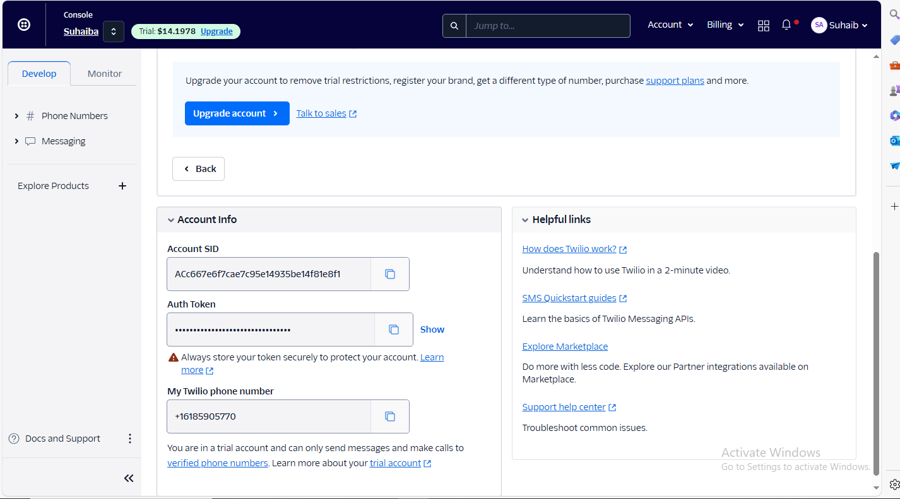
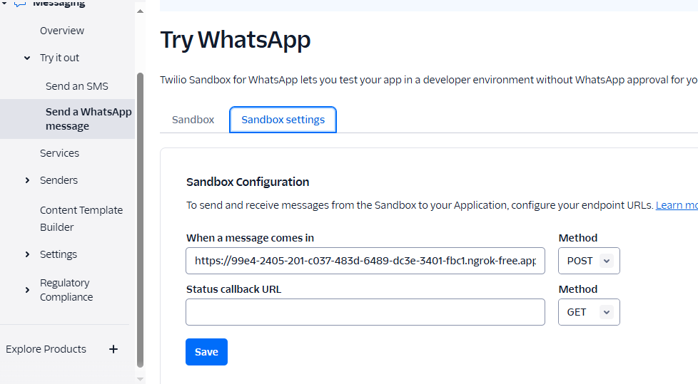

# Whatsapp LLM based chatbot

## Step:1 Get this repo in your codebase
- git clone https://github.com/Suhaib-88/Whatsapp-chatbot.git
- pip install requirements.txt

## Step:2 Setup your .env file with Authentications

-go to https://console.twilio.com/ and get your credentials


- TWILIO_ACCOUNT_SID="<YOUR_TWILIO_ACCOUNT_SID>"
- TWILIO_AUTH_TOKEN="<YOUR_TWILIO_AUTH_TOKEN>"
- TWILIO_FROM_NUMBER="<YOUR_FROM_NUMBER>" # Assigned by twilio
- TWILIO_TO_NUMBER="<YOUR_TO_NUMBER>" # You can set it to any valid number with whatsapp


## Step:3 Download openhermes LLM model from huggingface 

- ``` pip3 install huggingface-hub ``` <br>
- ``` huggingface-cli download TheBloke/OpenHermes-2.5-Mistral-7B-GGUF openhermes-2.5-mistral-7b.Q4_K_M.gguf --local-dir . --local-dir-use-symlinks False ```

## Step:4 Run ngrok for webhooks
Ngrok is a tool that exposes local servers to the internet through secure tunnels. This is useful for testing webhooks and APIs locally without deploying them to a public server.

``` ngrok http 8080 ```

If you don't have ngrok already:

- follow [ngrok docs](https://ngrok.com/download)


## Step:5 Update sandbox settings:



In our case ive updated to: https://99e4-2405-201-c037-483d-6489-dc3e-3401-fbc1.ngrok-free.app 
and saved

## Step 6: Run fastapi
FastAPI is a modern web framework for building APIs with Python. You can start a FastAPI server using uvicorn, which is an ASGI server for Python web applications.

- uvicorn <app_name>:app --reload,
- In our case it is ```uvicorn twilio_chatbot:app --reload``` 
 
## Step:7 Query the whatssapp Chatbot


